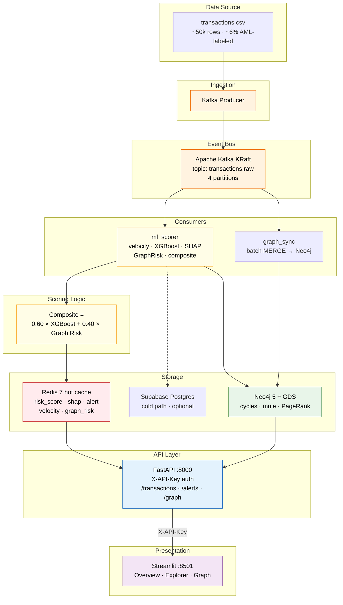
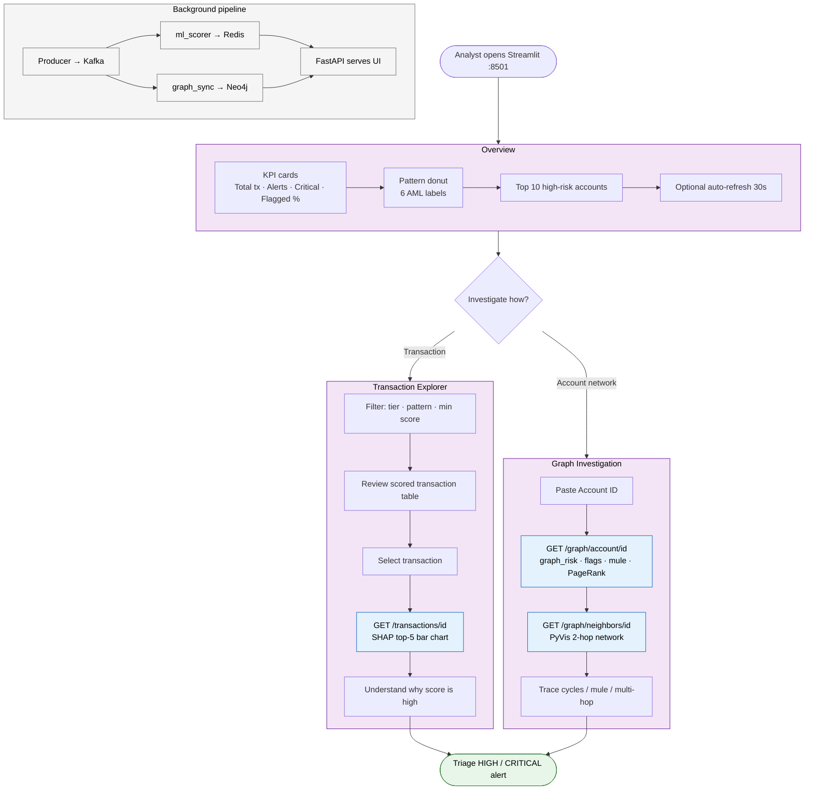

# AML Fraud Intelligence — Diagrams

Paste either block into [mermaid.live](https://mermaid.live) to export PNG/SVG.

---

## 1. System Architecture

**Risk tiers:** LOW &lt; 30 · MEDIUM 30–70 · HIGH 70–90 · CRITICAL &gt; 90

---

## 2. Analyst User Flow

